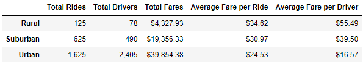
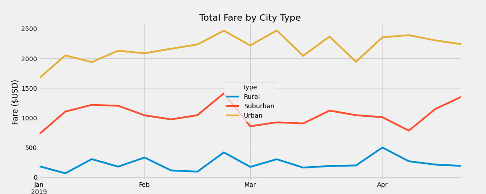

# PyBer Analysis

<!-- TABLE OF CONTENTS -->

  
Table of Contents

  <ol>
    <li>
      <a href="#Purpose">Purpose</a>
      <ul>
        <li><a href="#built-with">Built With</a></li>
      </ul>
    </li>
    <li>
      <a href="#getting-started">Getting Started</a>
      <ul>
        <li><a href="#prerequisites">Prerequisites</a></li>
        <li><a href="#installation">Installation</a></li>
      </ul>
    </li>
    <li><a href="#usage">Usage</a></li>
    <li><a href="#roadmap">Roadmap</a></li>
    <li><a href="#contributing">Contributing</a></li>
    <li><a href="#license">License</a></li>
    <li><a href="#contact">Contact</a></li>
    <li><a href="#acknowledgments">Acknowledgments</a></li>
  </ol>

## Purpose

Compare ride-sharing fares amongst Urban, Suburban, and Rural cities utilizing data visualizations for PyBer to promote access to ride-sharing services and determine affordability.

### Source Data obtained from CSV file from PyBer (an competitor of Uber haha). 
Utilized Python's Pandas to produce a summary dataframe and chart.

## Results: Screenshots from the DataFrame and multiple-line chart to display ride-sharing data among city types.

### Ratio of Rides to Drivers
- Urban cities have 1.48 times the number of drivers to rides
- Suburban cities have 1.27 times the number of rides to drivers
- Rural cities have 1.6 times the number of rides to drivers

The observed outcome is not surprising, given that cities are expected to generate more revenue because they have more inhabitants than suburban or rural locations.
### Average Fare per Ride
- Urban cities have the lowest average fare per ride at $24.53
- Suburban cities have the second highest average fare per ride at $30.97
- Rural cities have the highest average fare per ride at $34.62
When we look at the income created, the `Average Fare per Ride` is 20% lower in urban cities than suburban, and 30% lower in urban cities versus rural.
### Average Fare per Driver
- Urban cities have the lowest average fare per driver at $16.57
- Suburban cities have the second highest average fare per driver at $39.50
- Rural cities have the highest average fare per driver at $55.49
Rural drivers clearly outperform Suburban and Urban drivers in terms of `Average Fare per Driver`. The ratio is 3.3:1 for rural vs. urban, and 2.4:1 for suburban vs. urban. 

### Total Fares
- Urban cities have the greatest total fares at $39,854.38
- Suburban cities have the second highest total fares at $19,356.33
  - 2.06 times lower than urban cities

- Rural cities have the lowest total fares at 4,327.93
  - 9.2 times lower than urban cities
  - 4.47 times lower than suburban cities

### **Conclusions (explained via economics)

1. Urban area generate higher revenue for PyBer, very high 'supply & demand' of drivers
2. Customers in Urban areas pay less per ride, 'supply' of rides is higher than 'demand'
3. Rural areas have lower 'supply' of drivers hence customers face more expensive fares compared to Urban or Suburban areas

## Summary: Business recommendations 

In order to reduce the disparity between Urban, Suburban and Rural cities, we recomend the following:

1. Collect extra data points that span the whole year; for more accurate yearly trends
2. Rural cities are underserved, incentivize becoming a driver in rural (and suburban) areas; potentially may motivate drivers to midrate from urban areas  --> Create goal to raise minimum drivers by 10%

By: Huzaifa Hussain | https://www.linkedin.com/in/huzaifa-s-hussain/

